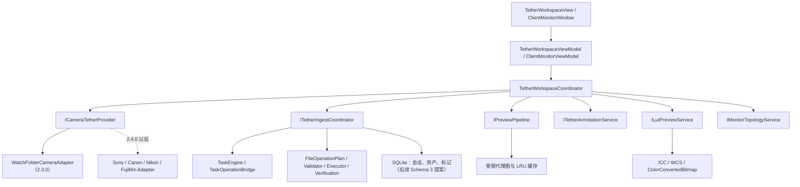
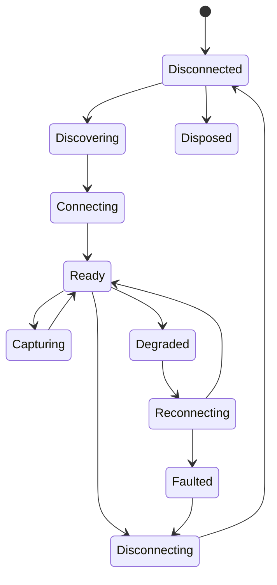

# 像素蛋挞 2.3.0 联机拍摄总体架构

## 1. 规划结论

2.3.0 的联机拍摄架构可行。建议本版本只交付 `WatchFolderCameraAdapter`、现场监看、LUT 显示预览和第二显示器，不接入真实厂商 SDK；Sony、Canon、Nikon、Fujifilm 适配器保留为清晰的接口边界，默认推迟到 2.4.0。

本轮阶段 A 只新增规划文档，不修改产品代码、版本号、SchemaVersion、Publish 配置或安装包。

## 2. 本地架构审计

当前仓库已经具备以下可复用基础：

- `ApplicationCompositionRoot`：集中组装数据库、任务、通知、审计和文件操作服务。
- `TaskEngine`、`TaskOperationBridge`：提供排队、进度、取消、暂停、恢复、`NeedsAttention` 和 `PartiallyCompleted`。
- `FileOperationPlan`、`FileOperationValidator`、`FileOperationExecutor`、`FileVerificationService`：提供 Copy、CreateNew、AutoNumber、Flush、长度及可选 SHA-256 校验。
- `UndoJournalService`：只在前置条件仍满足时撤销本任务创建的输出。
- `NotificationCenter`、`ErrorCodeCatalog`、`AuditLogService`：提供持久通知、统一错误码和日志脱敏。
- WPF 应用层和 `RAWSelectionAssistant.Core` 已分离，适合继续保持 View/ViewModel 与设备、文件 I/O 隔离。

当前没有相机连接、实时取景、LUT、显示器 ICC 或多显示器协调服务，必须新增独立模块，不能把这些职责塞入 `MainWindow` 或现有普通归片 ViewModel。

## 3. 总体分层



依赖方向固定为 UI → 用例协调层 → 通用接口 → 具体适配器/基础设施。核心业务不得引用厂商枚举、厂商 DLL 或厂商错误码。

## 4. 通用接口职责

### 4.1 `ICameraTetherProvider`

- 声明稳定的 `ProviderId`、显示名、版本、可用状态和不可用原因。
- 创建本 Provider 的发现服务和会话。
- 不负责 UI、数据库、源文件删除或复制。
- Provider 不可用时返回能力状态，不抛出导致应用启动失败的异常。

### 4.2 `ICameraDiscoveryService`

- 启动、停止设备发现并提供当前快照。
- 以事件或异步流发布新增、更新、移除设备。
- 设备标识为应用内部不透明 ID；序列号只能脱敏或使用带应用盐值的哈希。
- `WatchFolderCameraAdapter` 将用户选择的目录视为一个逻辑设备，不扫描其他目录。

### 4.3 `ICameraSession`

- 管理连接、断开、释放、状态变化和会话取消。
- 暴露 `SessionId`、Provider、设备摘要、连接状态和能力快照。
- `DisposeAsync` 只终止相机会话，不删除、移动或修改任何照片。

### 4.4 `ICameraCapabilityService`

- 返回逐项能力，而不是一个笼统的“支持联机”。
- 每项包含 `Supported`、`ReadOnly`、允许值/范围、当前值、不可用原因和来源版本。
- UI 对不支持项必须禁用并显示原因。

能力键至少覆盖：发现、USB、Wi-Fi、实时取景、快门、光圈、快门速度、ISO、白平衡、色温、曝光补偿、对焦模式、对焦点、电量、存储卡、JPG/RAW 传输、保存到相机、保存到电脑；视频只保留声明，不在 2.3.0 实现。

### 4.5 `ICameraCaptureService`

- 仅负责远程拍摄命令和结果，不直接把文件写入项目目录。
- 每次命令携带 `OperationId`，支持幂等结果和超时。
- 能力不支持时返回结构化失败，不尝试猜测厂商行为。

### 4.6 `ICameraLiveViewService`

- 提供有界、可取消的帧流和帧时间戳。
- 帧对象采用租约/所有权模型，消费后释放，禁止无限积压。
- 2.3.0 的 Watch Folder Provider 不宣称实时取景能力。

### 4.7 `ICameraTransferService`

- 发布已完成或待稳定的资产候选，不直接更新 UI。
- 负责 Provider 侧传输状态，不负责项目复制；项目复制交给统一文件操作系统。
- 支持 JPG/RAW 成对关联、部分完成、取消和重试语义。

### 4.8 `ICameraSettingsService`

- 读取/写入相机参数并根据能力描述做范围验证。
- 设置变更包含请求值、实际值、是否被相机调整、错误码。
- 2.3.0 不实现真实相机参数写入。

### 4.9 `ICameraConnectionMonitor`

- 监测目录、USB/Wi-Fi 或厂商 Host 的健康状态。
- 使用有上限的指数退避和抖动；不无限重连。
- 区分 `Disconnected`、`Degraded`、`Reconnecting`、`Faulted`。
- 联机故障不得改变普通归片任务状态。

## 5. 核心数据合同

建议新增以下不可变合同：

```text
CameraProviderDescriptor
CameraDeviceDescriptor
CameraCapabilityDescriptor
CameraCapabilitySnapshot
CameraSessionSnapshot
CameraAssetCandidate
TetherAssetSnapshot
TetherPairKey
LiveViewFrameLease
CameraOperationResult
ReconnectPolicy
```

关键规则：

- `CameraDeviceDescriptor.DeviceId` 为不透明 ID，不等于完整序列号。
- `CameraAssetCandidate` 只保存路径、长度、时间、格式、Provider 捕获 ID 和稳定状态，不保存图片二进制。
- JPG/RAW 配对优先使用 Provider 捕获 ID；Watch Folder 使用规范化文件名主干、时间窗口和目录来源形成 `TetherPairKey`。
- 不以完整路径、文件名或哈希作为日志消息。

## 6. 会话状态机



状态变化必须可观察、可测试，且不得由 ViewModel 自行推断。

## 7. 2.3.0 Provider 策略

### 7.1 正式可用 Provider

- `None`：默认状态；应用启动后不监视任何目录、不连接设备。
- `WatchFolderCameraAdapter`：用户显式选择目录并开始会话后才运行。

### 7.2 只规划、不交付的 Provider

- `SonyCameraAdapter`
- `CanonCameraAdapter`
- `NikonCameraAdapter`
- `FujifilmCameraAdapter`

Release 中不得注册 Fake Camera，不得显示“已支持”真实厂商，不得携带未审计厂商 DLL。

## 8. 厂商 SDK 进程边界

真实厂商 SDK 建议在 2.4.0 使用独立 x64 Host 进程：

- 主程序只引用通用合同和命名管道客户端。
- 每个厂商 Host 单独加载其原生 DLL，避免一个 SDK 崩溃终止主程序。
- IPC 使用本机命名管道，不开放 localhost 端口。
- Host 只接收相机命令和传输目标，不接收客户资料或项目备注。
- Host 版本、SDK 版本、相机固件和能力快照写入脱敏诊断字段。
- SDK 未安装、位数不匹配或许可未通过时，该 Provider 不注册。

Watch Folder Provider 保持进程内实现，不需要额外 Host。

## 9. 数据持久化提案

阶段 A 不修改 SchemaVersion。阶段 B 开始前建议单独评审 Schema 3，只增加结构化关系，不保存图片内容：

| 表 | 用途 | 禁止内容 |
|---|---|---|
| `TetherSessions` | 项目、Provider、目录、开始/结束时间、恢复状态 | 图片二进制、客户资料正文 |
| `TetherAssets` | 来源路径、规范化路径、格式、大小、时间、稳定/预览/配对状态 | RAW/JPG 内容、缩略图 BLOB |
| `TetherAnnotations` | 星级、颜色标签、摄影师备注、客户收藏、客户备注、拒绝标记 | 不写回源图；日志不得记录备注正文 |

代理图和 LUT 缓存继续放在 `%LocalAppData%\KitaoPhotoSelector\Cache\Tether\`，数据库只保存缓存键和状态。若阶段 B 不批准 Schema 3，则只能交付无持久标记的最小会话，不应再建立另一套临时 JSON 业务数据库。

## 10. 文件复制与任务中心

“复制到项目拍摄目录”和“同步到备份盘”必须通过现有：

`TaskEngine` → `TaskOperationBridge` → `FileOperationPlan` → `FileOperationValidator` → `FileOperationExecutor` → `FileVerificationService` → `UndoJournal`。

固定规则：

- `FileOperationType.Copy`
- `FileMode.CreateNew`
- `FileConflictPolicy.AutoNumber`
- Flush 到磁盘
- 校验长度，重要/备份任务可选 SHA-256
- 复制成功并校验后才更新数据库关系
- 不覆盖、不移动、不删除来源文件
- 部分复制映射为 `PartiallyCompleted`
- 断盘、权限或冲突映射为 `NeedsAttention`
- 撤销只删除本任务创建且未被外部修改的输出

## 11. 普通工作流隔离

- 联机模块由独立导航入口和独立协调器拥有。
- Provider 为 `None` 时不创建监视器、不启动后台循环。
- 联机数据库查询失败不得阻止普通归片页面加载。
- 联机预览解码失败只影响当前资产，不改变普通媒体索引。
- 相机/目录断开只产生联机通知和状态，不暂停其他 `TaskEngine` 任务。
- 清除联机缓存不得删除源文件、项目输出或普通缩略图缓存。

## 12. 隐私与审计

审计事件只记录：Provider 类型、会话/项目/任务 ID、能力键、状态转换、通用错误码、数量、耗时和脱敏设备 ID。

不得记录：客户/模特姓名、完整路径、完整文件名、图片内容、客户备注正文、摄影师备注正文、完整序列号、文件哈希或 LUT 文件名。`AuditLogService` 的现有脱敏继续复用，并为设备序列号和备注字段增加专项测试。

## 13. 阶段边界

- 阶段 A：当前文档、官方 SDK/色彩调研，不改产品代码。
- 阶段 B：Watch Folder MVP、稳定检测、恢复、可选安全复制。
- 阶段 C：现场监看、比较、标记、客户确认。
- 阶段 D：LUT 预览、ICC 提示、第二显示器。
- 阶段 E：性能、故障恢复、DPI、安装版验收。

真实厂商 SDK 默认进入 2.4.0，只有在许可、分发、x64、测试相机和支持矩阵全部通过门禁时才能提前。

## 14. 参考资料

- [.NET 10 FileSystemWatcher](https://learn.microsoft.com/en-us/dotnet/api/system.io.filesystemwatcher?view=net-10.0)
- [WPF ColorContext](https://learn.microsoft.com/en-us/dotnet/api/system.windows.media.colorcontext?view=windowsdesktop-10.0)
- [WPF ColorConvertedBitmap](https://learn.microsoft.com/en-us/dotnet/api/system.windows.media.imaging.colorconvertedbitmap?view=windowsdesktop-10.0)
- [Windows WcsGetDefaultColorProfile](https://learn.microsoft.com/en-us/windows/win32/api/icm/nf-icm-wcsgetdefaultcolorprofile)

