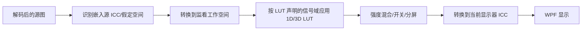

# 像素蛋挞 LUT 与 ICC 色彩规划

## 1. 结论

LUT 监看和基础 ICC 管理在现有 WPF/.NET 10 架构上可行。2.3.0 建议先实现 CPU 代理图 LUT、显示器 ICC 检测、明确的色彩提示和每屏独立转换；GPU 3D LUT、完整 RAW 色彩科学和软打样不作为本版本承诺。

LUT 默认只影响显示，不修改 RAW/JPG/PNG/TIFF，不写 EXIF，不覆盖文件。导出套用 LUT 必须是后续独立、用户明确发起的操作。

## 2. 色彩处理边界

推荐显示管线：



关键限制：`.cube` 文件通常不完整声明输入色彩空间、相机 Log 曲线、输出色域和显示意图。像素蛋挞不能仅凭文件扩展名判断 LUT 适用于 sRGB、S-Log、C-Log、N-Log 或 F-Log。

因此每个 LUT 需要一个本地 `LutDescriptor`：

```text
Id
DisplayName
SourcePath
ContentFingerprint
Kind (1D / 3D)
Size
DomainMin / DomainMax
ExpectedInput (Unknown / sRGB / UserDeclaredLog)
ExpectedOutput (Unknown / sRGB / DisplayP3 / UserDeclared)
Favorite
ImportedAt
ValidationState
```

MVP 只对 `ExpectedInput=sRGB`、`ExpectedOutput=sRGB` 的显示参考 LUT 给出“受支持”标记；未知或 Log LUT 可导入但必须显示警告并由用户声明监看预设。

## 3. `.cube` 解析

建议接口：

- `ILutParser`
- `ILutValidator`
- `ILutCatalogService`
- `ILutPreviewProcessor`
- `ILutCacheService`

解析器支持的安全子集：

- UTF-8/ASCII 文本；拒绝超大文件和包含 NUL 的内容。
- 空行和 `#` 注释。
- `TITLE`。
- `DOMAIN_MIN`、`DOMAIN_MAX`。
- `LUT_1D_SIZE` 或 `LUT_3D_SIZE`。
- 使用 invariant culture 的有限浮点数。
- 数据行必须严格等于声明数量。
- 1D 尺寸建议 2–65536。
- 3D 尺寸建议 2–65；更大需单独性能评估。

MVP 对同一文件同时包含 1D shaper 和 3D LUT 的方言返回“不兼容”，不猜测顺序。后续如扩展，必须用真实兼容样本和明确规范验证。

拒绝/警告：

- 缺少尺寸、重复冲突头、数据不足/过多。
- NaN、Infinity、非法十进制格式。
- `DOMAIN_MIN >= DOMAIN_MAX`。
- 维度或文件大小超过上限。
- 不支持关键字或混合 LUT。
- 文件在导入后被外部修改。

## 4. LUT 导入与存储

- 导入默认只关联原位置，不移动、不删除、不覆盖。
- 可选复制到本地 LUT 资料目录时复用统一文件操作系统，使用 Copy/CreateNew/AutoNumber/校验。
- 项目默认 LUT、相机默认 LUT、强度和监看预设只写项目配置，不写入图片。
- LUT 文件本体不写入 SQLite BLOB；数据库/配置只保存路径、解析元数据和内容指纹。
- 日志不记录 LUT 完整文件名、路径或内容指纹。
- LUT 丢失时保留配置，状态变为 Missing，并回退无 LUT 预览。

## 5. 1D 与 3D 算法

### 5.1 1D LUT

- 对 R/G/B 三通道分别线性插值。
- 输入先按 `DOMAIN_MIN/MAX` 归一化并钳制。
- 适用于曲线/通道变换，不宣称等价于完整相机色彩变换。

### 5.2 3D LUT

- MVP 使用三线性插值；代码结构预留四面体插值替换。
- LUT 数组使用连续浮点存储并设内存上限。
- 解析结果不可变，可在多张代理图间共享。
- 必须用 identity、通道交换、灰阶、边界值和已知小型合成 LUT 做数值测试。

### 5.3 强度与比较

- 强度 0–100%，默认 100%。
- 混合在同一监看工作空间完成：`output = lerp(original, transformed, strength)`。
- 开关比较保留同一缩放和视口。
- 分屏比较只改变显示裁切，不生成新文件。
- 快速切换采用“最近选择优先”的取消策略，旧计算结果不得覆盖新 LUT。

## 6. CPU 与 GPU 路线

### 6.1 2.3.0：CPU 优先

- 对最大边 2048px 的代理图执行 LUT。
- 使用有界后台工作队列；同一资产只保留最新请求。
- 可按行分块并行，但总并发受预览管线限制。
- 对 100% 图像按需、可取消，不在用户拖动强度时反复全分辨率计算。
- 结果缓存键：资产版本 + 代理尺寸 + LUT 指纹 + 强度 + 工作空间 + 显示器配置版本。

CPU 路线更容易做确定性测试和文件安全验证，适合 WPF MVP。

### 6.2 GPU：阶段 E 评估、默认不承诺

WPF 没有直接、低风险的通用 3D LUT 管线。若 CPU 基准不达标，再评估 Direct3D 11 互操作/独立渲染器：

- 3D texture + shader。
- 设备丢失恢复。
- 多显示器、不同 GPU、远程桌面和软件渲染降级。
- GPU 不可用时自动回 CPU。

在 GPU 路线通过稳定性、DPI、颜色一致性和安装包验证前，不替换 CPU 正式路径。

## 7. 源图色彩空间

- JPEG/TIFF/PNG 优先读取嵌入 ICC。
- 无嵌入配置时默认按 sRGB 监看并显示“未检测到嵌入配置，按 sRGB 假定”。
- Display P3、Adobe RGB 等可识别配置显示空间徽标。
- RAW 占位或嵌入 JPEG 预览只代表预览文件自身的色彩信息，不代表最终 RAW 显影。
- 不为未知相机 Profile 猜测矩阵，不宣称与 Lightroom/Capture One 颜色一致。

## 8. 显示器 ICC 检测

建议接口：

- `IMonitorColorProfileService`
- `IColorTransformService`
- `MonitorColorProfileSnapshot`
- `ColorManagementWarning`

Windows 路径：

1. 由 `IMonitorTopologyService` 获取设备名和屏幕句柄/边界。
2. 通过 Windows Color System 的 `WcsGetDefaultColorProfile` 和 `WcsGetDefaultColorProfileSize` 获取当前用户/系统作用域的默认显示配置。
3. 读取配置基本信息并建立版本键；不把完整路径写日志。
4. WPF 使用 `ColorContext` 表示 ICC/ICM，使用 `ColorConvertedBitmap` 或等价受控转换把工作空间映射到目标显示器。
5. 显示器配置变化时使对应缓存失效并重新渲染当前图。

Microsoft 文档说明 `ColorContext` 表示与位图关联的 ICC/ICM 配置，WCS 可检索设备默认配置。这足以支持基础每屏转换，但不等于显示器已经硬件校准。

## 9. 多显示器色彩

- 主屏和客户屏各自持有 `MonitorColorProfileSnapshot`。
- 同一 LUT 结果先在工作空间缓存，再分别转换到两个显示器，避免把主屏颜色结果直接复制到客户屏。
- 两屏 ICC 不同或一屏无配置时显示状态提示。
- 窗口跨屏移动时根据主要占用屏幕切换目标配置，并取消旧转换。
- 显示器断开后清除该屏缓存，不影响会话或源图。

## 10. 用户提示

### 正常

- “已使用显示器配置：sRGB/厂商配置名称摘要”。
- “监看 LUT：名称；强度 70%”。

### 警告

- “未检测到显示器 ICC，当前按 sRGB 监看。”
- “此显示器为宽色域配置；不同屏幕可能存在差异。”
- “LUT 未声明输入空间，预览仅供参考。”
- “当前为 RAW 嵌入预览，不代表最终显影。”
- “显示器未经过像素蛋挞验证校色，不能保证绝对色准。”

不显示完整 ICC 路径，不宣称 Delta E、硬件校准或印刷软打样精度。

## 11. MVP 与后续边界

### 2.3.0 MVP

- `.cube` 安全解析。
- 1D/3D CPU LUT。
- 收藏、搜索、项目默认、强度、开关、分屏。
- sRGB 工作空间。
- 嵌入 ICC 识别和每屏默认 ICC 检测。
- 无配置、宽色域、未知 LUT 输入空间提示。
- 原图零修改验证。

### 后续

- GPU 3D LUT。
- 组合 shaper + 3D LUT。
- 厂商 Log/色域预设和经过验证的 IDT/ODT。
- HDR、10-bit 交换链、系统 HDR 模式。
- 软打样、打印机配置、纸张模拟、黑点补偿。
- 完整 RAW 显影和相机色彩配置。

## 12. 测试策略

- 测试生成 identity/反相/通道交换/边界 LUT，不使用来源不明的商业 LUT。
- 损坏、超大、非法浮点、数据数量错误、不兼容混合 LUT。
- 开关、强度、缓存命中、快速切换取消。
- 同一输入在 CPU 重复运行结果确定。
- LUT 开关前后源文件长度、时间、SHA-256 不变。
- ICC 缺失、损坏、sRGB、Display P3/Adobe RGB 标识、两屏不同配置。
- 配置变更、窗口跨屏、显示器断开。
- 100–200% DPI、深浅/高对比、软件渲染和 GPU 不可用。
- 所有配置和 LUT 文件测试使用独立临时目录。

## 13. 官方参考

- [WPF ColorContext](https://learn.microsoft.com/en-us/dotnet/api/system.windows.media.colorcontext?view=windowsdesktop-10.0)
- [WPF ColorConvertedBitmap](https://learn.microsoft.com/en-us/dotnet/api/system.windows.media.imaging.colorconvertedbitmap?view=windowsdesktop-10.0)
- [WcsGetDefaultColorProfile](https://learn.microsoft.com/en-us/windows/win32/api/icm/nf-icm-wcsgetdefaultcolorprofile)
- [WCS profile management](https://learn.microsoft.com/en-us/windows/win32/wcs/profile-management-functions)
- [Using device profiles with WCS](https://learn.microsoft.com/en-us/windows/win32/wcs/using-device-profiles-with-wcs)

