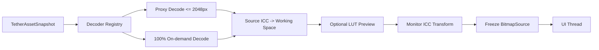

# 像素蛋挞现场监看工作区规划

## 1. 目标

现场监看工作区面向拍摄现场的低延迟查看、比较和确认。它消费通用联机会话和资产快照，不直接操作 `FileSystemWatcher`、厂商 SDK、SQLite 或源文件。

推荐新增：

- `TetherWorkspaceView.xaml`
- `TetherWorkspaceViewModel.cs`
- `TetherWorkspaceCoordinator.cs`
- `TetherAssetListViewModel.cs`
- `TetherPreviewViewModel.cs`
- `TetherInspectorViewModel.cs`
- `PreviewPipeline`、`PreviewCacheService`、`HistogramService`
- `TetherAnnotationService`

## 2. 页面布局

```text
┌─────────────────────────────────────────────────────────────────────┐
│ 会话状态 | Provider | 目录/设备摘要 | 开始/停止 | 客户屏幕 | 任务中心 │
├───────────────┬───────────────────────────────────┬─────────────────┤
│ 左：拍摄列表   │ 中：大图监看                      │ 右：检查器       │
│ 缩略图         │ Fit / 100% / 自由缩放 / 拖动      │ EXIF             │
│ 筛选与排序     │ 全屏 / 对比 / 叠加 / 辅助线       │ 直方图/警告      │
│ 星级/标签状态  │ 最新照片、锁定照片状态            │ LUT/标记/备注    │
└───────────────┴───────────────────────────────────┴─────────────────┘
```

建议默认比例：左侧 280–340 DIP，右侧 300–360 DIP，中间自适应；窗口较窄时右侧检查器变为抽屉，不压缩大图到不可用。

## 3. ViewModel 边界

`TetherWorkspaceViewModel` 只负责：

- 订阅会话、资产、预览、标记、LUT 和显示器的只读快照。
- 发出开始/停止、选择、锁定、导航、缩放、比较、标记等命令。
- 暴露用户可见状态、命令可用性和错误提示。

禁止：

- 直接创建 `FileSystemWatcher`。
- 直接打开文件或解码 Bitmap。
- 直接调用厂商 SDK。
- 直接执行 SQL。
- 直接复制、移动、删除源文件。
- 通过厂商名 `switch` 决定 UI；必须依据能力描述。

## 4. 最新照片与锁定逻辑

状态分为：

- `AutoFollowLatest=true`：新资产 Ready 后自动选择并显示。
- `PreviewLocked=true`：保持当前图，不因新照片变化；列表仍显示“有 N 张新照片”。
- 用户手动选择旧图时，默认暂时退出自动跟随并显示“返回最新照片”按钮。
- 重新点击“自动显示最新”才恢复，不在用户检查 100% 时抢走焦点。

新资产通知采用单调序号而不是系统时间排序，避免相机时间、文件时间和时区差异导致最新图倒序。

## 5. 拍摄缩略图列表

- 使用虚拟化列表和渐进缩略图，不一次创建全部图像控件。
- 默认按会话序号倒序；可切换拍摄时间正序。
- 筛选：全部、最新、未查看、星级、颜色标签、客户收藏、快速拒绝、等待 RAW、NeedsAttention。
- 缩略图展示：代理图/占位、序号、格式组合、星级/标签/收藏、复制/备份状态。
- 客户显示模式隐藏路径和技术错误详情。
- 同一 JPG/RAW 对显示为一个视觉资产，可展开查看组成文件。

## 6. 大图预览管线



规则：

- 代理图用于 Fit、对比、直方图和 LUT 交互。
- 100% 只加载当前视口所需图或单张完整图；离开 100% 后允许回收。
- 使用版本令牌取消旧选择的解码；旧结果不得覆盖新选择。
- 文件流 `OnLoad` 后立即释放，不锁住相机输出目录。
- 解码、ICC、LUT 和直方图不在 UI 线程执行。
- 内存不足时先释放 100% 缓存、历史对比图和 LUT 派生图，保留当前代理图。

## 7. 缩放与拖动

- Fit：保持完整图像可见，切图时默认沿用 Fit。
- 100%：1 图像像素对应 1 设备像素；在不同 DPI 显示器上必须按实际缩放换算。
- 自由缩放：建议 5%–1600%，鼠标位置为缩放中心。
- 拖动：只在图像大于视口时启用；边界钳制。
- 双击：Fit 与 100% 切换。
- 切换图像时可选保留缩放/位置；默认重置 Fit，比较模式保留同步缩放。

## 8. 对比模式

### 8.1 并排对比

- 2–4 张，MVP 先支持 2 张。
- 同步/独立缩放可切换。
- 同步拖动基于归一化图像坐标，不假设分辨率相同。
- 每张显示独立星级、标签和收藏状态。

### 8.2 重叠对比

- A/B 透明度滑块或按住快捷键切换。
- 对齐基于中心、尺寸或用户指定锚点。
- 不自动写入任何图像或导出结果。

### 8.3 参考图叠加

- 参考图只能由用户显式选择。
- 仅保留路径引用和不透明度/变换参数。
- 不扫描参考图所在文件夹，不把参考图加入联机会话。

## 9. EXIF、直方图和曝光警告

- EXIF 通过现有 `MetadataExtractor` 读取；失败返回 `MetadataReadFailed`，不阻止预览。
- 显示字段：拍摄时间、焦距、光圈、快门、ISO、曝光补偿、白平衡摘要、相机/镜头显示名。
- 序列号只显示脱敏值，客户屏幕默认不显示任何设备识别字段。
- RGB 直方图基于当前代理图和当前监看 LUT 的显示结果，并明确标注“监看直方图”。
- 高光/阴影警告阈值可调，默认关闭；警告为叠加层，不修改图像。
- 如果代理图不是 RAW 完整渲染，界面显示“基于预览图，不代表 RAW 最终结果”。

## 10. 构图辅助

- 三分线、中心十字、安全框、1:1/4:5/16:9 等裁切参考框。
- 辅助线仅为 UI 层 Overlay，不进入图像处理和导出。
- 高对比主题下保证线条与图像背景均可辨识。

## 11. 星级、颜色标签和客户确认

建议数据范围：

- 星级：0–5。
- 颜色标签：None、Red、Yellow、Green、Blue、Purple。
- 摄影师备注：本地文本，不写入照片。
- 客户收藏：布尔值，可由主屏或客户屏切换。
- 客户备注：本地文本，不写入照片。
- 快速拒绝：布尔标记，仅筛选，不删除文件。

保存由 `ITetherAnnotationService` 事务完成。每次修改返回更新后的快照；窗口之间通过同一服务同步。日志只记录“字段类型已更新”，不得记录备注正文。

## 12. 键盘和操作效率

建议快捷键：

- `←/→`：上一张/下一张。
- `Space`：锁定/恢复自动最新。
- `F`：Fit，`1`：100%。
- `1–5`：星级，`0`：清除星级。
- `C`：客户收藏。
- `X`：快速拒绝（不删除）。
- `L`：LUT 开关对比。
- `Tab`：隐藏/显示检查器。
- `F11`：当前屏全屏。

快捷键在输入备注时不得触发；所有功能同时提供可访问按钮。

## 13. 错误和降级

| 问题 | UI 行为 |
|---|---|
| 源文件仍在写入 | 缩略图骨架 + “正在接收” |
| RAW 无预览 | RAW 占位 + “等待 JPG/预览不可用” |
| 源文件丢失 | 保留标记和元数据，显示 Missing，不从数据库删除 |
| 解码失败 | 当前图错误卡片，列表/会话继续 |
| LUT 损坏 | 自动关闭该 LUT，显示原始监看图 |
| ICC 不可用 | 使用明确的 sRGB 安全回退提示，不宣称准确 |
| 数据库暂时锁定 | 标记操作进入 `NeedsAttention`，预览继续 |

## 14. 性能目标

- 稳定文件进入列表：本地 SSD P95 小于 1 秒（不含文件自身写入时间）。
- 可预览 JPG 自动显示：稳定后 P95 小于 1.5 秒。
- 切换已有代理图：P95 小于 100ms。
- LUT 开关：缓存命中小于 100ms；CPU 重算目标小于 500ms（2048px 代理）。
- 100 张连拍期间 UI 输入不冻结超过 100ms。
- 1000 张会话列表保持虚拟化，不长期持有 1000 张大图 Bitmap。

目标必须在阶段 E 以固定合成样本和低/中/高配置机器验证，未达标时优先保证稳定和文件安全。

## 15. DPI、主题和无障碍

- 覆盖 100%、125%、150%、175%、200% 逻辑 DPI。
- 深色、浅色、高对比主题不使用仅靠颜色表达星级/状态。
- 缩略图、按钮、滑块、备注输入和错误提示有可访问名称。
- 焦点顺序从会话栏 → 列表 → 大图工具 → 检查器。
- 客户屏与主屏 DPI 不同时，各窗口独立响应 DPI 变化。

## 16. 安全边界

- “快速拒绝”永远不触发文件删除。
- 页面不提供永久删除入口。
- 客户备注、摄影师备注、星级和 LUT 设置只写本地数据库/项目配置。
- 任何导出或复制均是独立、明确操作，进入任务中心。
- 客户模式默认隐藏文件名、路径、相机序列号、客户资料和技术错误详情。

