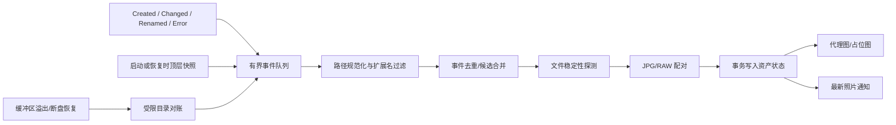

# 像素蛋挞看守文件夹联机 MVP

## 1. 目标与结论

Watch Folder MVP 可在不接入真实相机 SDK 的情况下交付可靠的现场拍摄体验。它把相机原厂软件、Capture One、Lightroom 或其他联机工具输出到用户指定目录的文件视为“新拍摄候选”，等待写入稳定后进入像素蛋挞监看列表。

默认行为固定为只读关联：不移动、不删除、不覆盖、不上传、不修改 EXIF、不写入 RAW。

## 2. 范围

阶段 B 实现：

- 用户显式选择一个目录并开始会话。
- 只监视该目录顶层，`IncludeSubdirectories=false`。
- 支持 JPG、JPEG、PNG、TIFF 和用户当前配置允许的 RAW 扩展名。
- 自动检测新文件、等待稳定、去重、恢复、配对和发布预览。
- 可选复制到项目拍摄目录；可选同步到备份盘。
- 复制和备份进入统一任务中心。
- RAW 无预览时显示安全占位，不把资产判定为失败或删除。

阶段 B 不实现：真实相机发现/控制、实时取景、远程快门、文件夹递归扫描、自动删除来源、源文件改名、网络上传或全盘索引。

## 3. 核心组件

```text
WatchFolderCameraAdapter
WatchFolderDiscoveryService
WatchFolderSession
WatchFolderEventSource
WatchFolderReconciler
FileStabilityProbe
TetherCandidateDeduplicator
TetherPairingService
TetherIngestCoordinator
TetherSessionRepository
TetherAssetRepository
TetherCopyWorkflow
```

`FileSystemWatcher` 只用于低延迟提示，不能作为真相来源。Microsoft 官方文档明确指出一次复杂文件操作可能产生多个事件，短时间大量事件还会导致内部缓冲区溢出并丢失变化。因此必须有数据库状态和受限补扫。

## 4. 事件与对账数据流



## 5. 会话启动

1. 用户通过文件夹选择器选择一个完全限定路径。
2. 校验目录存在、可列举、不是应用缓存/日志/数据库目录、不是系统根目录。
3. 明确显示“只监视此文件夹，不扫描子文件夹”。
4. 创建会话记录并保存目录路径；日志只记录会话 ID 和脱敏根标识。
5. 获取一次顶层快照，与当前会话/恢复记录对账。
6. 仅在用户点击“开始监看”后启用 watcher。

Provider 默认保持 `None`。应用启动、打开工作台或进入设置都不得自动监视最近目录。

## 6. 扩展名与临时文件

允许：`.jpg`、`.jpeg`、`.png`、`.tif`、`.tiff`，以及 `AppSettings.EnabledRawExtensions` 和用户明确配置的 RAW 扩展名。

默认忽略：

- `.tmp`、`.temp`、`.partial`、`.download`、`.crdownload`
- 以 `~`、`.` 开头的临时名
- 零字节且仍在变化的文件
- 目录、符号链接/重解析点指向的目录
- 当前会话输出目录中的应用临时文件

临时文件重命名为正式扩展名后，以最终路径重新进入稳定性探测。

## 7. 文件稳定性算法

候选文件在满足全部条件前不得解码、复制或写入“Ready”：

1. 文件存在且不是目录。
2. 连续至少 3 次采样的长度和 `LastWriteTimeUtc` 相同。
3. 采样间隔建议 300–500ms；大文件或网络/外接盘允许指数退避。
4. 可以只读打开并读取最小头部；共享模式不长期锁住文件。
5. 对可解码格式完成轻量头部/容器验证；不要求完整生成大图。
6. 稳定等待有上限，建议默认 30 秒，可对大 RAW 延长到 120 秒。

超时后进入 `NeedsAttention/FileStillWriting` 或 `FileLocked`，不会删除候选；后续 Changed/Renamed 或用户重试可以继续。

稳定探测必须可取消，且每个候选只允许一个活动探测任务。

## 8. 去重与幂等

事件去重键分两层：

- 候选键：会话 ID + 规范化完整路径。
- 稳定资产键：会话 ID + 规范化路径 + 长度 + 最后写入时间。

规则：

- Created/Changed/Renamed 的重复事件合并到同一候选。
- 同一路径内容发生后续变化时生成新修订，不覆盖已确认的资产快照。
- watcher 溢出后补扫只补充数据库中不存在或状态未完成的项。
- 软件重启后根据数据库状态恢复 `Stabilizing`、`CopyPending`、`NeedsAttention`，不重复导入 `Ready/Copied`。
- 不默认计算全文件哈希；只有安全复制/备份或用户启用严格验证时计算 SHA-256。

## 9. JPG/RAW 配对

Watch Folder 没有可靠厂商 Capture ID，配对采用保守评分：

1. 相同目录和规范化文件名主干；
2. 扩展名分属可预览图与 RAW；
3. 拍摄/最后写入时间落在可配置窗口内；
4. EXIF 拍摄时间和相机脱敏 ID一致时提高置信度；
5. 同名多候选时不自动覆盖，进入 `NeedsAttention`。

JPG 先到时立即预览，显示“等待 RAW”；RAW 后到后更新配对。RAW 先到而无法解码时显示 RAW 占位，JPG 到达后替换预览但保留 RAW 资产。

## 10. 预览降级

- JPG/JPEG/PNG/TIFF：使用 WPF/WIC 代理解码，流采用 `OnLoad` 后立即释放。
- RAW：通过 `IRawPreviewDecoder` 边界请求嵌入预览；2.3.0 可先提供 `NoneRawPreviewDecoder`。
- RAW 无解码器、损坏或不支持时：显示格式、大小、拍摄时间和 `RawPreviewUnavailable` 占位。
- 解码失败不阻止复制、不修改源文件、不把普通归片标记为失败。

不把 Windows 上偶然安装的第三方 RAW Codec 宣称为正式支持矩阵。

## 11. 可选复制到项目目录

复制默认关闭，用户必须选择项目拍摄目录并明确启用。实现必须复用现有系统：

```text
TaskOperationBridge.RunAsync
  -> FileOperationPlanner.CreateAsync(Copy, AutoNumber)
  -> FileOperationExecutor.ExecuteAsync
  -> FileVerificationService
  -> UndoJournal
```

固定安全要求：

- Copy；不 Move。
- `FileMode.CreateNew`；不覆盖。
- 同名 AutoNumber。
- Flush 和长度校验；备份任务建议 SHA-256。
- 只有输出完成并校验后才把 `ManagedCopyPath` 写入数据库。
- 源文件从不删除。
- 部分成功映射为 `PartiallyCompleted`。
- 断盘/无权限/空间不足映射为 `NeedsAttention`。
- 撤销只删除本任务创建且大小/哈希仍匹配的副本。

## 12. 可选备份盘同步

- 与“项目目录复制”是两个独立操作计划和任务结果。
- 默认关闭，不因选择 Watch Folder 自动启用。
- 项目复制成功、备份失败时，整体会话继续，备份任务为 `PartiallyCompleted/NeedsAttention`。
- 备份盘断开后不无限重试；显示待处理数量，用户重连后手动继续。
- 备份不得成为显示最新照片的前置条件。

## 13. 断开、删除和权限变化

| 情况 | 行为 |
|---|---|
| 目录暂时不可访问 | 会话进入 `Degraded`，停止新探测，保留列表和标记 |
| 外接盘断开 | 通知一次并进入有上限重连；不影响普通归片 |
| 目录被删除 | 进入 `NeedsAttention`，提供重新定位或结束会话 |
| 权限被撤销 | 停止读取并显示通用错误码，不反复弹窗 |
| watcher 缓冲区溢出 | 标记需对账，执行一次顶层受限补扫 |
| 应用重启 | 恢复未完成状态并重新验证路径；不自动开始会话，需用户确认 |

## 14. 性能预算

- watcher 事件进入有界 Channel；满时合并为一次“需要补扫”信号。
- 稳定性探测并发默认 4；代理解码默认 2；100% 解码默认 1。
- 新照片预览优先级高于历史缩略图。
- 缩略图生成后台执行，UI 线程只接收冻结的 `BitmapSource` 或视图状态。
- 代理图建议最大边 2048px，缩略图 256/512px。
- LRU 缓存有字节和项数双上限；清理失败不影响源照片。
- 不长期持有全部 Bitmap，不保持源文件句柄。

## 15. 审计与隐私

允许日志字段：会话 ID、Provider=`WatchFolder`、事件类别、候选数、成功/失败数、耗时、通用错误码、脱敏目录键。

禁止：完整目录、完整文件名、客户/模特姓名、图片内容、EXIF 姓名字段、备注正文、哈希。通知 UI 可在本机显示当前文件名，但通知历史和诊断包使用“第 N 个文件”或脱敏显示。

## 16. 阶段 B 验收门禁

- 新文件、写入未完成、重复事件、临时改名、大量连拍通过。
- JPG/RAW 两种到达顺序通过。
- 缓冲区溢出模拟和受限补扫通过。
- 断盘、目录删除、权限变化、软件重启通过。
- 中文、空格、长路径和大文件均使用独立临时目录通过。
- 默认不复制；启用复制后源文件哈希不变。
- Release Provider 默认为 None，Fake Camera 不注册。
- 原 867 项测试保留，Debug/Release 全量通过后才结束阶段 B。

## 17. 官方依据

- [FileSystemWatcher](https://learn.microsoft.com/en-us/dotnet/api/system.io.filesystemwatcher?view=net-10.0)
- [FileSystemWatcher.Error](https://learn.microsoft.com/en-us/dotnet/api/system.io.filesystemwatcher.error?view=net-10.0)
- [InternalBufferOverflowException](https://learn.microsoft.com/en-us/dotnet/api/system.io.internalbufferoverflowexception?view=net-10.0)
- [FileSystemWatcher.Changed](https://learn.microsoft.com/en-us/dotnet/api/system.io.filesystemwatcher.changed?view=net-10.0)

