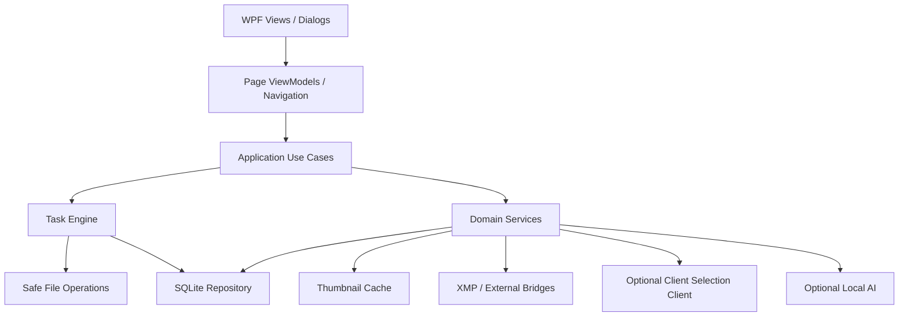
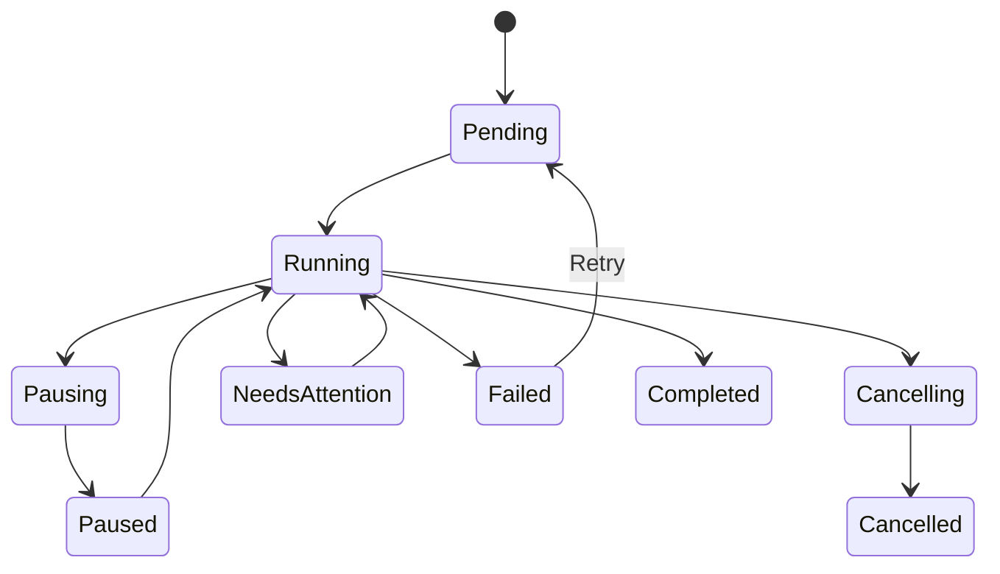

# 像素蛋挞数据与任务架构

## 1. 当前架构审计

当前工程分为 WPF 应用层和 `RAWSelectionAssistant.Core` 核心层。核心层包含模型、索引、匹配、复制、报告、设置、项目历史、授权和教程服务；应用层负责手工组装服务、MainViewModel、主窗口、主题和系统交互。

优势：核心文件逻辑已与 WPF 基本分离，服务普遍支持 `CancellationToken`，设置、索引和项目 JSON 采用临时文件后替换。

局限：没有数据库、统一任务队列、操作日志、检查点、Undo Journal 和正式缩略图缓存；任务中心目前主要映射单次 `IsBusy` 状态。

## 2. 目标分层



### UI 层

- 每个工具使用独立 View 和 ViewModel；
- 不直接执行文件 IO；
- 只订阅任务和项目快照；
- 导航、对话框、文件选择和主题通过接口注入。

### Application 层

- 组织用例：建立项目、生成整理计划、执行拼图导出、创建任务；
- 校验权限和功能门控；
- 生成操作清单，不直接遍历 UI 控件。

### Domain/Core 层

- 文件名规范化、匹配、冲突决策、质量评估、分组规则；
- 不引用 WPF；
- 所有危险动作返回计划或决策，不在规则层直接修改文件。

### Infrastructure 层

- SQLite、文件系统、缩略图、XMP、网络、日志、许可证；
- 通过接口隔离；
- 可在测试中替换为隔离实现。

## 3. SQLite 目标模型

| 表 | 主要字段 | 说明 |
|---|---|---|
| SchemaInfo | Version, AppliedAt | 数据库版本和迁移历史 |
| Projects | Id, Name, Type, Status, RootPath, UpdatedAt | 项目主记录 |
| ProjectSources | ProjectId, Path, Purpose, Priority | 来源目录，不存文件内容 |
| SelectionInputs | ProjectId, OriginalInput, NormalizedName, NumericId | 选片记录 |
| MediaFiles | ProjectId, FullPath, Size, ModifiedAt, Format, MetadataState | 索引记录 |
| MatchDecisions | SelectionId, Format, Status, SelectedFileId, Reason | 匹配和人工决定 |
| Tasks | Id, ProjectId, Type, State, Progress, CreatedAt | 长任务 |
| TaskSteps | TaskId, Sequence, State, Checkpoint | 任务步骤 |
| OperationItems | TaskId, Source, Destination, Operation, ConflictPolicy, State | 文件操作清单 |
| UndoJournals | TaskId, ReverseOperation, Preconditions | 撤销记录 |
| Templates | Id, Type, Name, SchemaVersion, JsonPayload | 模板主体 |
| QuickTools | ToolId, SortOrder, IsPinned | 快捷布局 |
| ThumbnailEntries | CacheKey, CachePath, Bytes, LastAccessAt | 缓存索引 |
| ShootBookings | Id, ProjectId, StartDateTime, EndDateTime, Status, Location | 本地拍摄排期 |
| ShootRequirementItems | Id, BookingId, Text, IsCompleted, Priority, SortOrder | 拍摄准备清单 |
| BookingDocuments | Id, BookingId, ProjectId, DocumentType, FilePath, IsMissing | 只保存本地文档引用 |
| BookingReminders | Id, BookingId, TriggerAt, IsEnabled, LastTriggeredAt | 用户主动启用的本地提醒 |

图片本体、RAW、完整缩略图二进制和客户原片不得写入数据库。

## 4. Schema 与迁移

1. 每个数据库包含唯一 `SchemaVersion`；
2. 迁移按顺序、可重复检测、不可跳步；
3. 迁移前复制数据库到版本化 Backup 目录；
4. 迁移在事务中执行；
5. 失败保留原数据库并进入恢复模式；
6. 应用版本低于数据库要求时只读打开或拒绝写入；
7. JSON→SQLite 首次迁移保留原 JSON，不立即删除；
8. 提供导出项目清单和诊断信息。

## 5. 统一任务模型

```text
TaskDefinition
  Id
  ProjectId
  Type
  DisplayName
  InputSnapshot
  OperationPlanId
  CreatedAt

TaskRuntimeState
  State
  Progress
  CurrentStep
  Checkpoint
  LastError
  RetryCount
```

状态机：



## 6. 执行规则

- 同一目标目录的写任务默认串行；
- 扫描、哈希和缩略图使用受限并发；
- 进度更新节流，避免 UI 线程被大量通知占用；
- 每个文件完成后提交检查点；
- 暂停发生在安全边界，不中断不可恢复的原子替换；
- 取消只删除本任务创建的部分输出；
- 重试不得重复覆盖已成功输出；
- 应用崩溃后任务状态为 Interrupted，必须用户选择恢复。

## 7. 缩略图缓存

缓存目录：LocalAppData 下独立 `Cache/Thumbnails/<size>/`。

缓存键：`SHA256(normalizedPath + size + lastWriteUtc + fileLength + variant)`。

策略：

- 列表 160px、卡片 320px、详情 1024px；
- 使用代理图，不长期持有源文件句柄；
- RAW 优先嵌入预览；
- LRU，默认上限可配置；
- 清理失败不影响项目；
- 缓存损坏删除单项并重建；
- 缓存迁移只移动缓存，不改变项目源路径。

## 8. 外部能力边界

- XMP 桥接：备份、解析、保留未知字段、原子替换；
- Lightroom/Capture One：文件清单和 XMP，不直接改数据库；
- 云选片：独立客户端接口，默认未配置；
- 本地 AI：独立可选模块，默认关闭；
- 插件：后续使用声明式清单和隔离加载，当前不得加载任意 DLL。

## 9. 分阶段落地

- 2.0.4：先引入版本化 `OrganizePlan` 和 `CollageProject` JSON，不引入完整数据库；
- 2.1.0：SQLite、Task Engine、Operation Manifest 和 Undo Journal；
- 2.2.0：工作日历、项目、模板、健康检查、缩略图索引迁入数据库；
- 2.3.0+：桥接、云选片和 AI 通过稳定接口接入。

## 10. 工作日历数据边界

- 排期、准备清单、文档引用和提醒存入 SQLite，文档本体不写入数据库；
- `ProjectId` 可为空，建立关联后可从拍摄详情进入归片工作区和项目历史；
- 金额仅作本地记录，不派生支付、发票或经营统计能力；
- 排期冲突检测返回决策，不静默覆盖或阻止用户明确选择“仍然保存”；
- 文档“移除关联”只删除数据库关系，不删除电脑原文件；需要复制到项目目录时必须走 `FileOperationPlan`；
- 日志和诊断包对姓名、电话、金额与本地文档路径进行脱敏。
