# 像素蛋挞版本依赖关系图

## 当前基线

当前真实基线为 2.0.3。2.0.3 已有独立安装包和回传报告，但工程没有 Git Tag，因此“冻结”仍需在下一阶段建立版本控制后补充可追溯证据。

```mermaid
flowchart LR
    V203["2.0.3<br/>界面统一、快捷工具、工具入口"]
    GIT["版本治理门禁<br/>Git / Tag / 不可变发布目录"]
    V204["2.0.4<br/>整理图片与拼图可用<br/>快捷排序"]
    SAFE["文件安全门禁<br/>操作清单 / 默认复制 / 防覆盖"]
    V210["2.1.0<br/>统一任务引擎与文件安全层"]
    DB["数据门禁<br/>SQLite / Migration / Backup / Recovery"]
    V220["2.2.0<br/>模板、查重、联系表、健康检查"]
    XMP["桥接门禁<br/>XMP备份、合并和恢复"]
    V230["2.3.0<br/>摄影软件桥接"]
    PRIVACY["隐私门禁<br/>云端数据最小化与删除策略"]
    V240["2.4.0<br/>客户选片MVP"]
    AI["模型门禁<br/>本地模型、许可、硬件与隐私"]
    V250["2.5.0<br/>本地智能辅助"]
    RELEASE["发布门禁<br/>证书、更新回滚、生产授权"]
    V260["2.6.0<br/>发布与商业化基础"]
    V300["3.0.0<br/>正式摄影工作台"]

    V203 --> GIT --> V204 --> SAFE --> V210 --> DB --> V220 --> XMP --> V230 --> PRIVACY --> V240 --> AI --> V250 --> RELEASE --> V260 --> V300
```

## 版本依赖表

| 目标版本 | 必须依赖 | 不满足时的处理 |
|---|---|---|
| 2.0.4 | 2.0.3 冻结；Git main/分支/Tag；版本化发布目录 | 不开始功能开发 |
| 2.1.0 | 2.0.4 所有文件操作使用操作清单；冲突策略统一 | 继续修复 2.0.4，不建立任务队列 |
| 2.2.0 | 任务状态可持久化；SQLite 迁移和备份可用 | 不增加模板和健康检查数据 |
| 2.3.0 | 项目数据库稳定；XMP 解析、备份、合并测试通过 | 只保留接口和文档 |
| 2.4.0 | 隐私评审；服务端、域名、存储、删除和安全配置齐全 | 不上传任何用户文件 |
| 2.5.0 | 本地模型来源、许可证、硬件基线和隐私说明齐全 | 不打包模型，不伪造 AI 结果 |
| 2.6.0 | 正式证书、更新源、生产授权平台和公开验证配置 | 标记未配置，不伪造签名/授权 |
| 3.0.0 | 数据迁移、任务恢复、更新回滚、端到端流程和 DPI 全通过 | 不宣称正式版 |

## 跨版本稳定契约

以下能力在所有版本中必须保持：

- 本地分片、归片、JPG/RAW、自定义格式和冲突处理；
- 客户 JPG 默认只作选片依据，来源目录优先；
- 默认复制、默认不覆盖、默认不删除；
- Provider=None 时不启用 Mock 专业版；
- WinExe 无控制台；
- 不引入 localhost 或隐式后台服务；
- 免费版不削弱基础文件安全能力；
- 每版独立安装包、报告、测试目录和 SHA-256。

## 用户验收节点

每个版本完成后必须停止。用户明确确认后，才允许创建下一版本分支并开始实现。确认不能被旧报告、自动化测试或内部判断替代。
